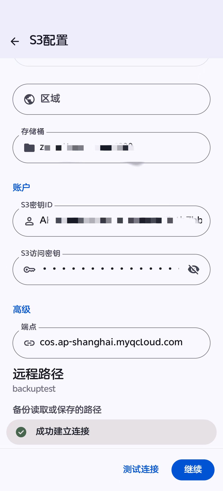
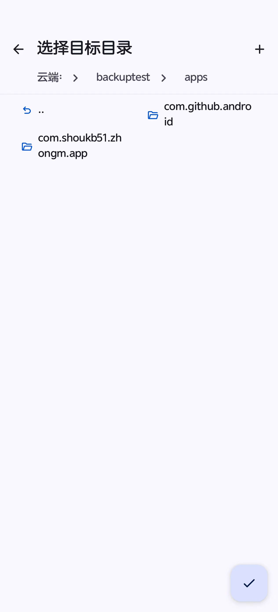
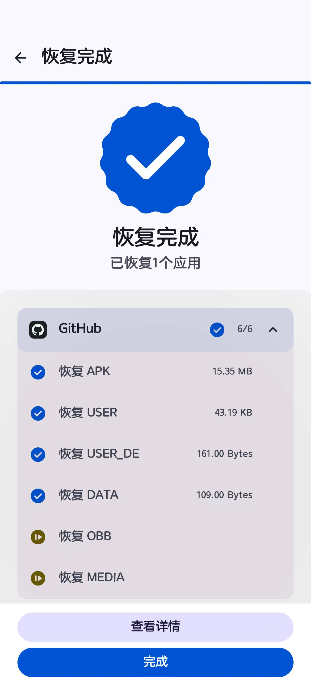
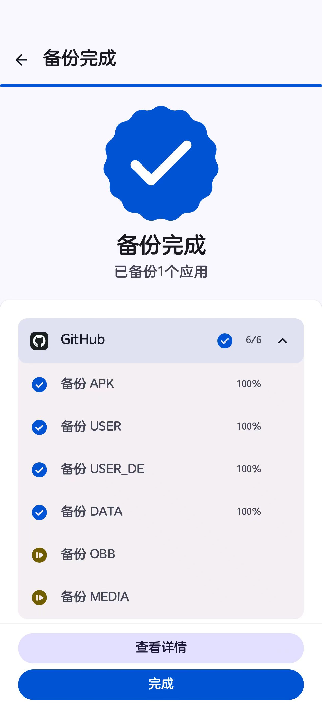
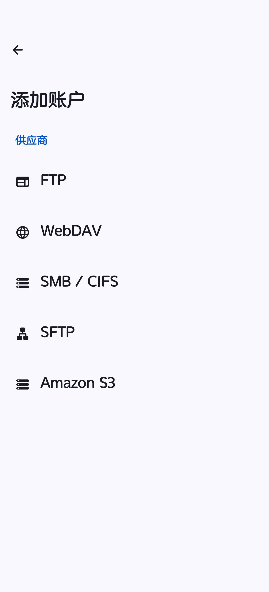
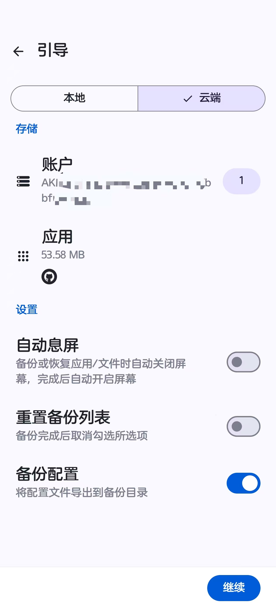

  

 <a> English </a> | <a href="./README_zh-CN.md"> 中文说明 </a>   

  

<h1 align="center">DataBackup Revived</h1>

  
  
  
  
  

Free and open-source data backup application with multi-version backup support

  

## Overview

:star: Based on [XayahSuSuSu](https://github.com/XayahSuSuSu/Android-DataBackup) .

## Usage
See [documentation](https://DataBackupOfficial.github.io).

## Features
* :deciduous_tree: **Root needed, support [Magisk](https://github.com/topjohnwu/Magisk), [KernelSU](https://github.com/tiann/KernelSU), [APatch](https://github.com/bmax121/APatch)**

* :cyclone: **Multi-user Support**

* :cloud: **Cloud Storage with Multiple Protocols**

* :sunglasses: **100% Data Integrity**

* :zap: **Fast**

* :sunny: **Easy**

* :package: **Multi-Version Backup Support**

* :rose: **...**

## Version Comparison

### Cloud Storage Protocol Support

| Feature | Old Version (DataBackup) | New Version (DataBackup Revived 3.0.0) |  
|---------|--------------------------|----------------------------------------|  
| **S3 Protocol** | ❌ Not supported | ✅ HTTP/HTTPS selectable |  
| **FTP Protocol** | ✅ Supported | ✅ Supported |  
| **SFTP Protocol** | ✅ Supported | ✅ Supported |  
| **WebDAV Protocol** | ✅ Supported | ✅ Supported |  
| **SMB/CIFS Protocol** | ✅ Supported | ✅ Supported |  
| **Local Storage** | ✅ Supported | ✅ Supported |

### Multi-Version Backup

| Feature | Old Version | New Version |  
|---------|-------------|-------------|  
| **Multiple Backups per App** | ❌ Single backup only | ✅ Multiple timestamp-based backups |  
| **Backup History** | ❌ Not supported | ✅ View all historical backups in restore list |  
| **Timestamp Display** | ❌ Not shown | ✅ 3-row layout with timestamp in restore list |  
| **Backup Identification** | ⚠️ Overwrite previous backup | ✅ Each backup identified by timestamp |  
| **Partial Failure Handling** | ⚠️ May leave incomplete files | ✅ Auto-cleanup on failure |  
| **Backward Compatibility** | N/A | ✅ Can restore old backups without timestamp |  

### User Interface Improvements

| Feature | Old Version | New Version |  
|---------|-------------|-------------|  
| **App Name** | "数据备份" / "DataBackup" | "数据备份 Revived" / "DataBackup Revived" |  
| **List Layout** | 2-row layout | ✅ 3-row layout with timestamp (restore mode) |  
| **Version Display** | Horizontal layout | ✅ Vertical layout for better readability |  
| **Dashboard Spacing** | Standard spacing | ✅ Optimized spacing for clarity |  

### Technical Changes

| Feature | Old Version | New Version |  
|---------|-------------|-------------|  
| **Package Name** | `com.xayah.databackup.*` | `com.xayah.databackup.revived.*` |  
| **Version Number** | 2.x.x | **3.0.0** (fresh start) |

## Screenshot-S3

  
      
      

  

## Screenshot

  
      
      

  

## Download
Get the APK from the [Releases](https://github.com/543069760/Android-DataBackup-S3/releases).

## Translation

## Contributors
Thanks to all these wonderful people!

## Support
If you enjoy this app and want to help it become better, feel free to sponsor me!

## LICENSE
[GNU General Public License v3.0](./LICENSE)